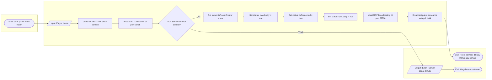
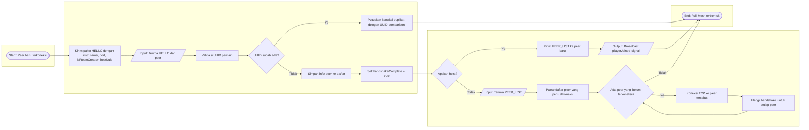
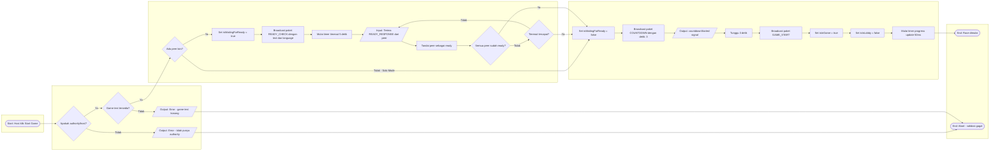
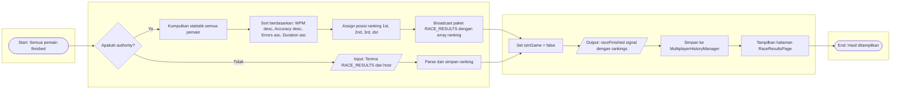
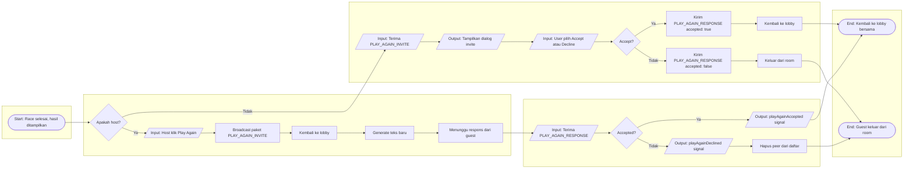

# Rapid Texter - Multiplayer Flowchart

Dokumen ini berisi diagram alur (flowchart) yang menjelaskan cara kerja sistem multiplayer pada Rapid Texter. Sistem ini menggunakan arsitektur **Peer-to-Peer (P2P) Full Mesh** di mana setiap klien terhubung langsung ke semua klien lainnya.

> [!NOTE]
> **Komponen Jaringan:**
> - **UDP Discovery**: Port 52766 untuk penemuan room di LAN
> - **TCP Mesh**: Port 52765 untuk koneksi data antar peer
> - **Authority**: Floating Authority dengan aturan UUID terendah

---

## 1. Alur Host Membuat Room (Create Room Flow)

---

## 2. Alur Guest Bergabung ke Room (Join Room Flow)

```mermaid
flowchart LR
    subgraph START_JOIN [" "]
        A([Start: User pilih Join Room])
    end
    
    subgraph DISCOVERY [" "]
        B[/Input: Player Name/]
        C[Mulai scanning UDP pada port 52766]
        D[Dengarkan broadcast dari host]
        E{Menerima paket announce?}
        F[Parse informasi room: hostName, IP, port, playerCount]
        G[/Output: Tampilkan daftar room/]
        H[/Input: User pilih room/]
    end
    
    subgraph CONNECT [" "]
        I[Koneksi TCP ke host pada port 52765]
        J{Koneksi berhasil dalam 5 detik?}
        K[Set status: isConnecting = false]
        L[Set status: isConnected = true]
        M[Kirim paket HELLO ke host]
        N[Terima paket HELLO dari host]
        O[Terima PEER_LIST dari host]
        P[Koneksi ke peer lain dalam mesh]
    end
    
    subgraph END_JOIN [" "]
        Q([End: Berhasil bergabung ke lobby])
        R[/Output: Error - Koneksi timeout/]
        S([End: Gagal bergabung])
    end
    
    A --> B
    B --> C
    C --> D
    D --> E
    E -->|Ya| F
    E -->|Timeout 30s| R
    R --> S
    F --> G
    G --> H
    H --> I
    I --> J
    J -->|Ya| K
    J -->|Tidak| R
    K --> L
    L --> M
    M --> N
    N --> O
    O --> P
    P --> Q
```

---

## 3. Alur Pembentukan Mesh Penuh (Full Mesh Building)

---

## 4. Alur Memulai Game (Start Game Flow)

---

## 5. Alur Permainan Race (Race Gameplay Flow)

```mermaid
flowchart LR
    subgraph START_RACE [" "]
        A([Start: Game dimulai])
    end
    
    subgraph TYPING [" "]
        B[/Input: User mengetik karakter/]
        C[Hitung position, wpm, accuracy, errors]
        D[Update progress lokal]
        E{Timer 50ms tercapai?}
        F[Broadcast paket PROGRESS_UPDATE ke semua peer]
        G[/Input: Terima PROGRESS_UPDATE dari peer/]
        H[Update progress peer di UI]
    end
    
    subgraph FINISH_CHECK [" "]
        I{Semua karakter diketik?}
        J[Hitung durasi final]
        K[Set progress lokal = 100%]
        L[Broadcast paket FINISH dengan wpm, accuracy, errors, duration]
        M[/Input: Terima FINISH dari peer/]
        N[Tandai peer sebagai finished]
        O{Semua pemain sudah finish?}
    end
    
    subgraph END_RACE [" "]
        P([End: Lanjut ke hasil race])
        Q([End: Menunggu pemain lain])
    end
    
    A --> B
    B --> C
    C --> D
    D --> E
    E -->|Ya| F
    E -->|Tidak| G
    F --> G
    G --> H
    H --> I
    I -->|Tidak| B
    I -->|Ya| J
    J --> K
    K --> L
    L --> M
    M --> N
    N --> O
    O -->|Ya| P
    O -->|Tidak| Q
    Q --> M
```

---

## 6. Alur Penentuan Hasil Race (Race Results Flow)

---

## 7. Alur Play Again (Bermain Lagi)

---

## 8. Alur Pemain Keluar/Disconnect (Player Leave Flow)

```mermaid
flowchart LR
    subgraph START_LEAVE [" "]
        A([Start: Pemain disconnect atau leave])
    end
    
    subgraph DETECTION [" "]
        B[/Input: Socket disconnect detected/]
        C[Ambil UUID pemain yang keluar]
        D{Dalam game aktif?}
    end
    
    subgraph IN_GAME [" "]
        E[Tandai pemain hasLeft = true]
        F[Pertahankan data untuk hasil]
        G[Broadcast PLAYER_LEFT ke semua peer]
        H{Semua pemain aktif sudah finish?}
        I[Lanjut ke hasil race]
    end
    
    subgraph IN_LOBBY [" "]
        J[Hapus peer dari daftar]
        K[Broadcast PLAYER_LEFT ke semua peer]
        L[/Output: playerLeft signal/]
    end
    
    subgraph AUTHORITY_CHECK [" "]
        M{Apakah host yang keluar?}
        N[Migrasi authority ke UUID terendah]
        O[Update isAuthority untuk pemilik baru]
        P[/Output: authorityChanged signal/]
    end
    
    subgraph END_LEAVE [" "]
        Q([End: Pemain dihapus, game lanjut])
        R([End: Pemain dihapus dari lobby])
    end
    
    A --> B
    B --> C
    C --> D
    D -->|Ya| E
    E --> F
    F --> G
    G --> H
    H -->|Ya| I
    I --> M
    H -->|Tidak| M
    D -->|Tidak| J
    J --> K
    K --> L
    L --> M
    M -->|Ya| N
    N --> O
    O --> P
    P --> Q
    M -->|Tidak| Q
    Q --> R
```

---

## 9. Alur Lengkap Sistem Multiplayer (Complete System Flow)

```mermaid
flowchart LR
    subgraph ENTRY [" "]
        A([Start: Menu Multiplayer])
        B[/Input: Pilih Create atau Join/]
        C{Create Room?}
    end
    
    subgraph CREATE_FLOW [" "]
        D[Create Room]
        E[Start TCP Server]
        F[Start UDP Broadcast]
    end
    
    subgraph JOIN_FLOW [" "]
        G[Scan for Rooms]
        H[Select Room]
        I[Connect via TCP]
        J[Handshake HELLO]
        K[Build Full Mesh]
    end
    
    subgraph LOBBY [" "]
        L[Lobby State]
        M{Host klik Start?}
        N[Ready Check]
        O[Countdown 3s]
    end
    
    subgraph GAME [" "]
        P[Race Gameplay]
        Q[Progress Updates setiap 50ms]
        R{Selesai mengetik?}
        S[Kirim FINISH]
        T{Semua pemain selesai?}
    end
    
    subgraph RESULTS [" "]
        U[Calculate Rankings]
        V[Show Results]
        W{Play Again?}
    end
    
    subgraph EXIT [" "]
        X([End: Kembali ke menu])
    end
    
    A --> B
    B --> C
    C -->|Ya| D
    D --> E
    E --> F
    F --> L
    C -->|Tidak| G
    G --> H
    H --> I
    I --> J
    J --> K
    K --> L
    L --> M
    M -->|Ya| N
    N --> O
    O --> P
    M -->|Tidak| L
    P --> Q
    Q --> R
    R -->|Ya| S
    R -->|Tidak| P
    S --> T
    T -->|Tidak| P
    T -->|Ya| U
    U --> V
    V --> W
    W -->|Ya| L
    W -->|Tidak| X
```

---

## Legenda Simbol Flowchart

| Simbol | Bentuk | Keterangan |
|--------|--------|------------|
| `([...])` | Oval / Stadium | **Start** dan **End** - Titik awal dan akhir proses |
| `[...]` | Persegi Panjang | **Process** - Proses atau aksi yang dilakukan |
| `{...}` | Belah Ketupat | **Decision** - Keputusan dengan cabang Ya/Tidak |
| `[/.../]` | Jajar Genjang | **Input/Output** - Data masuk atau keluar sistem |

---

## Tipe Paket Jaringan

| Paket | Deskripsi | Arah |
|-------|-----------|------|
| `HELLO` | Handshake awal dengan info pemain | Bi-directional |
| `PEER_LIST` | Daftar peer untuk pembentukan mesh | Host → Guest |
| `READY_CHECK` | Permintaan konfirmasi ready | Host → All |
| `READY_RESPONSE` | Respons konfirmasi ready | Guest → Host |
| `COUNTDOWN` | Sinyal countdown sebelum race | Host → All |
| `GAME_START` | Sinyal mulai race | Host → All |
| `GAME_TEXT` | Distribusi teks game | Host → All |
| `PROGRESS_UPDATE` | Update progress mengetik real-time | All → All |
| `FINISH` | Notifikasi pemain selesai | All → All |
| `PLAYER_LEFT` | Notifikasi pemain keluar | All → All |
| `RACE_RESULTS` | Hasil akhir dengan ranking | Host → All |
| `PLAY_AGAIN_INVITE` | Undangan bermain lagi | Host → All |
| `PLAY_AGAIN_RESPONSE` | Respons undangan | Guest → Host |
| `KICK` | Mengeluarkan pemain | Host → Target |

---

## Konstanta Sistem

| Konstanta | Nilai | Keterangan |
|-----------|-------|------------|
| `DISCOVERY_PORT` | 52766 | Port UDP untuk discovery |
| `TCP_PORT` | 52765 | Port TCP untuk koneksi mesh |
| `ANNOUNCE_INTERVAL_MS` | 1000 | Interval broadcast (1 detik) |
| `PROGRESS_UPDATE_MS` | 50 | Interval update progress (50ms) |
| `ROOM_TIMEOUT_MS` | 5000 | Timeout room stale (5 detik) |
| `SCAN_TIMEOUT_MS` | 30000 | Timeout scanning (30 detik) |
| `MAX_PLAYERS` | 8 | Maksimum pemain per room |
